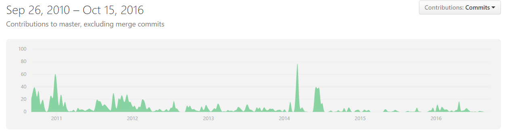

# ESOF - Relatório 1
## WorldEdit
 
### Descrição do Projecto 

O WorldEdit é um *plugin* para o jogo Minecraft que permite editar o mundo 3D do jogo através de funcionalidades novas fornecidas por este plugin.

*Figura 1 - Logotipo do World Edit*

O Minecraft é um jogo do tipo *sandbox* e *openworld* onde o jogador pode construir qualquer coisa num mundo 3D gerado aleatoriamente a partir de blocos/cubos de diferentes materiais (*voxels*). Os jogadores podem ainda explorar o mundo, recolher recursos e combater contra inimigos ou outros jogadores.

Este pode ser jogado tanto no modo *singleplayer* como em *multiplayer* e suporta *plugins*, uma extensão do servidor que adiciona novas funcionalidades ao jogo ou modifica as já existentes sem que seja necessário um *client custom* para aceder ao mesmo (o que o diferencia de um *mod*).

O projeto que vamos analisar é *open source* e está sob a licença GNU Lesser General Public License v3.

O objetivo deste *plugin* é fornecer um modo mais rápido e eficiente de editar o mundo do jogo.

Das funcionalidades de edição do mundo, podem-se destacar:
- Criar construções de uma forma mais rápida;
- Criar, substituir ou apagar centenas de blocos em segundos;
- Nivelar terreno.
- Usar novas *tools* e *brushes* para construir montanhas de blocos;
- Gerar esferas, cilindros, cubóides, etc;
- Teletransportar o jogador para outras áreas apenas clicando ou usando um comando na consola;
- Escolher uma área e restaurar o seu estado anterior, através de *backups*.

O projeto foi inicializado em Setembro de 2010 por Albert Pham (“sk89q”), que juntamente com outros três utilizadores (“TomyLobo”, “wizjany” e “ zml2008”), tiveram o maior impacto no desenvolvimento do projeto.

Foi lançada a primeira versão “WorldEdit 4.6” em Agosto de 2011. Até agora, este *plugin* conta com mais 15 milhões de downloads, sendo a versão “WorldEdit 6.1” a mais bem-sucedida, lançada em 2015, com 2 milhões de *downloads*.

A principal linguagem de programação usada é Java, que no momento da elaboração deste relatório, engloba cerca de 99,2% segundo o Github. Os 0.8% restantes do código estão escritos usando a linguagem de programação Javascript, e consistem em *craftscripts*. Um *craftscript* é um ficheiro que permite a execução, através de um único comando, de uma tarefa complexa de edição do mundo do *Minecraft*, como a geração aleatória de um labirinto.

Tem um total de 64 contribuidores, 8 dos quais estiveram presentes durante todo o desenvolvimento e são os responsáveis pelas contribuições mais relevantes. Embora frequentemente atualizado, já é um projeto bastante completo, por isso não está em grande desenvolvimento de momento.

### Processo de Desenvolvimento

Um processo de desenvolvimento de software define um conjunto estruturado de atividades para desenvolver um sistema de software. Seguir um processo de desenvolvimento aumenta a eficiência e consistência do trabalho de desenvolvimento do sistema e permite detetar aspetos a melhorar.

Vamos começar por falar de alguns princípios gerais do desenvolvimento do projeto para o World Edit apontados pelo seu principal contribuidor.

Logo após, vamos brevemente apresentar a comunidade do WorldEdit.

De seguida, vamos ver com mais detalhe como funciona o sistema de contribuições para o projeto.

Subsequentemente, vamos nos debruçar sobre o modelos que vão ao encontro do processo de software adotado.

Por fim, vamos analisar a evolução do projeto e a estrutura do repositório.     

#### Aspetos gerais

Segundo Albert Pham (conhecido por “sk89q” no *Github*), o principal contribuidor do projeto, o processo de desenvolvimento deste projeto rege-se pelos seguintes princípios:
- Pequenas alterações ao código são *commited* diretamente no branch principal;
- Grandes alterações são *commited* para *branches* individuais e são desenvolvidas ao longo do tempo nesse mesmo branch até à funcionalidade estar completa. Quando essa funcionalidade está pronta para ser *merged*, é criado um *pull request* e o código é revisto para proceder ao merge com o *branch* principal (*master*), se for aprovado;
- Testes unitários são corridos frequentemente, tal como ferramentas que permitem detectar se existe algo suspeito no código (para garantir segurança);
- Sugestões de novas funcionalidades e reports de bugs são registados no *issue tracker*;
- Novas versões do *plugin* são lançadas periodicamente.

#### Comunidade

A comunidade do WorldEdit é composta pelos __colaboradores do projeto__ e por __quem usa__ este *plugin*. A comunidade tem uma grande facilidade de comunicação com os autores do projeto, sendo frequente sugerirem __novas funcionalidades__, __tirarem dúvidas__ ou fazerem __*reports* de bugs__ que encontram no *plugin*.
Para contacto direito com o autor principal do projeto Albert Pham, um dos meios de comunicação disponíveis é um __canal *IRC*__, comum a todos os seus <a href=http://skq.me/irc/irc.esper.net/sk89q>projetos</a>, e o seu <a href=http://twitter.com/sk89q>__Twitter pessoal__</a>.
Existe também um <a href=http://forum.enginehub.org/>__fórum__</a>, onde os membros da comunidade comunicam regularmente entre si e com os colaboradores do projeto sobre assuntos diversos, sendo os mais comuns dúvidas acerca de funcionalidades do *plugin* e *report* de erros.
Existe ainda um <a href=http://dev.enginehub.org/youtrack/issues/WORLDEDIT?p=0&f=false>__*issue tracker*__</a>, onde grande parte dos *reports* são sobre __erros e atualizações do *plugin*__, ou tratam-se de propostas para __novas funcionalidades__. Cada __issue__ é acompanhado de informação acerca da __plataforma em questão__ (se alguma) e do seu __estado__, por exemplo, não serem capazes de reproduzir novamente um *bug*, já terem resolvido o problema, etc.
Por fim, existe também o __site oficial do *plugin*__ onde podemos encontrar informações acerca deste, videos de como o utilizar, como fazer download e instalação, questões frequentes, __documentação do *plugin*__, fórum de discussão e *issue tracker* já mencionados e o código fonte do projeto.

#### Contribuições

__Qualquer membro__ da comunidade __pode contribuir__ para este projeto. No entanto, as regras que os autores do projeto definem são bastante rígidas. Estas regras estão definidas num __ficheiro da pasta principal__, __CONTRIBUTING.md__, que por sua vez é referido no __README.md__ do projeto.
Um exemplo notável de uma regra a seguir para que uma contribuição seja aceite é que o novo código siga as __convenções de programação da Oracle__. A título de exemplo, uma convenção recomendada para programação em Java (mas que pode ser estendida para outras linguagens semelhantes) é de declarar apenas uma variável em cada linha de código (isto incentiva a escrita de comentários a explicar o papel dessa variável no programa). 
Outra regra que deve ser seguida pelos contribuidores é que o código deve ter sido devidamente testado.
Depois de __feito um *pull request*__, o código é __testado__ novamente na totalidade com testes unitários por parte de outros membros do projeto, antes de ser __aceite e *merged* com o *branch* principal__.

#### Modelos de processo de *software* usados

Um modelo de processo de *software* é uma __representação abstrata de um processo de desenvolvimento de *software*__.
O projeto rege-se segundo um modelo próximo do __*Incremental Development and Delivery*__ que consiste em desenvolver o projeto __incrementalmente e iterativamente__, e avaliar cada incremento antes de proceder para a próxima tarefa. Cada incremento consiste no __desenvolvimento de uma ou mais *features*__ ou na __resolução de um ou vários *bugs*__, reportados através do *issue tracker* do projeto.
Tal como referido na secção dos “Princípios gerais” do desenvolvimento do software deste projeto, várias funcionalidades novas foram sendo __desenvolvidas ao mesmo tempo em *branches* diferentes__, segundo o __modelo *Waterfall*__, onde a funcionalidades são definidas, é feito o *design* do *software*, implementado o código, são feitos testes unitários, é feita a integração e testes no sistema, e por fim é __colocada a funcionalidade no *branch* principal__.
 O projeto também segue de perto vários princípios do __desenvolvimento ágil__ (*Agile*) de *software* pois o *software* encontra-se em __constante evolução__ (*commits* ocorrem a um ritmo semanal, nos períodos mais ativos), incorporando novas *features* e corrigindo *bugs*, graças a uma rede de dezenas de colaboradores que cooperam entre si e estabelecem diálogo a um ritmo frequente através de discussões em cada tópico do *issue tracker* ou de cada *pull request*, por exemplo.
 
#### Evolução do projeto

O projeto teve mais atividade nos __primeiros 2 anos__ de desenvolvimento do *plugin*, entre 2010 e 2011, e voltou a ter __grande atividade em 2014__. 
De momento, __o projeto não se encontra muito ativo__, tendo sido já __intensivamente desenvolvido no passado__ e portanto trata-se um __projeto bastante completo__.
No momento da elaboração deste relatório, o commit mais recente para o *master branch* é do dia 2 de Setembro de 2016, e os últimos *commits* relacionam-se com pequenas correções do código e atualizações para a plataforma Forge, uma *API* de *modding*, que torna mais fácil criar novos *mods* e verificar se são compatíveis com *mods* já existentes.
 
 
*Figura 2 - Evolução dos *commits* do projeto ao longo dos anos.*

#### Organização do repositório

Existem um total de __27 *branches*__, relativas a funcionalidades que estão a ser desenvolvidas à parte. Após o desenvolvimento e posterior análise do código, o *branch* é *merged* com o *branch* principal.
Existem também um total de __103 *releases*__, correspondentes a lançamentos *alpha*, beta e oficiais do plugin. As descrições detalhadas de todas as funcionalidades adicionadas em cada lançamento estão registadas num ficheiro __CHANGELOG.txt__ no *branch* principal.

