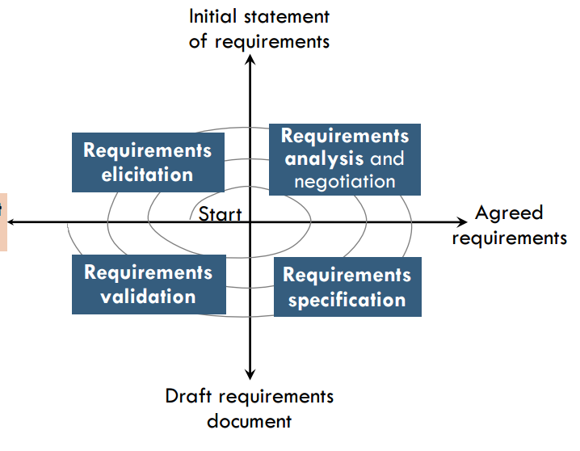

# ESOF - Relatório 2
## WorldEdit

### Processo de engenharia dos requisitos

O __processo de engenharia de requisitos__ consiste no __estudo das necessidades do cliente e dos utilizadores__ da aplicação para chegar à __definição dos requisitos do sistema, do *hardware* e do *software*__.

No âmbito deste relatório, vamos-nos focar nos requisitos de *software*. Um __requisito de *software*__ consiste numa __propriedade que o *software* deve incorporar para resolver um problema específico__.

Assim, a motivação dos processos de engenharia de requisitos é de __converter problemas ou necessidades vagamente definidas em propriedades bem definidas do sistema__.

O __ciclo do processo de engenharia de requisitos é a primeira fase do processo de engenharia de *software*__. Trata-se de um passo crítico para a qualidade do produto final pois __muitos dos defeitos da aplicação têm como origem erros este ciclo__, e __o custo de correção de erros cresce exponencialmente ao longo das fases do processo de *software*__.

O ciclo pode ser dividido em quatro fases.

	
	<em> Figura 1: Representação visual do ciclo do processo de engenharia de requisitos</em>

O __levantamento de requisitos__ consiste na __interação entre a equipa de desenvolvimento e os *stakeholders*__ para __identificar os problemas que a aplicação deve resolver e as necessidades que deve satisfazer__.

A __análise e negociação dos requisitos__ passa por detetar e __resolver conflitos entre os requisitos__ e resolver outros problemas que lhes possam estar associados, tal como a sua ambiguidade.
