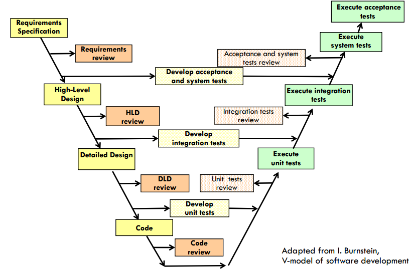
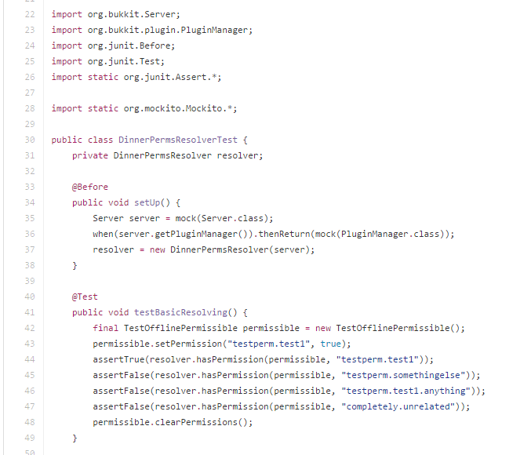
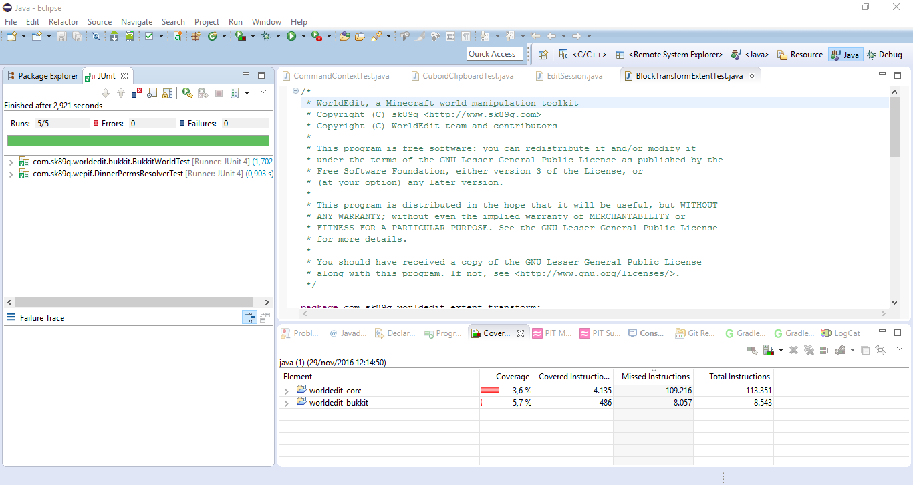
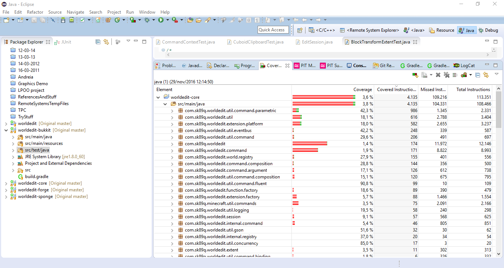
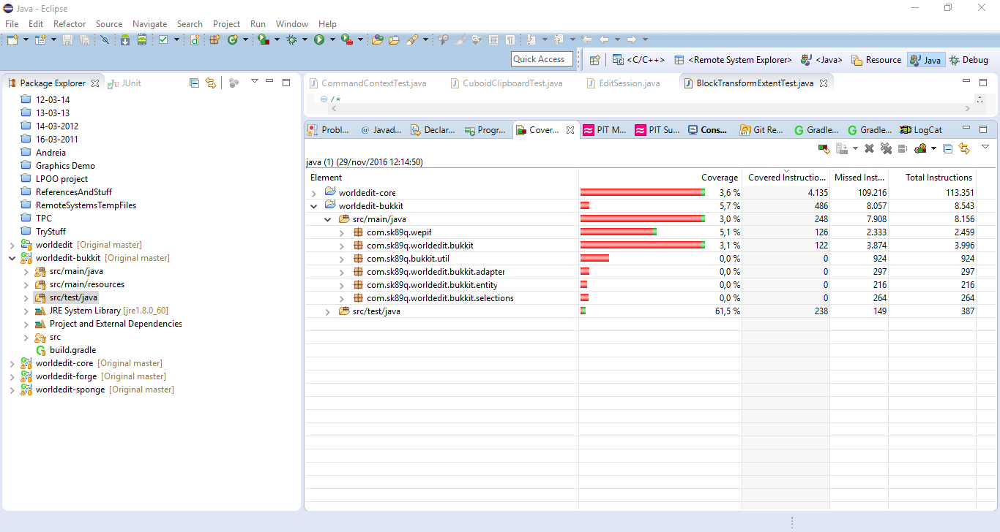
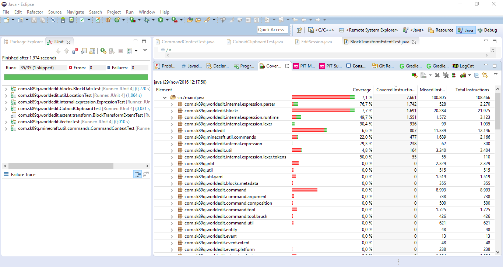
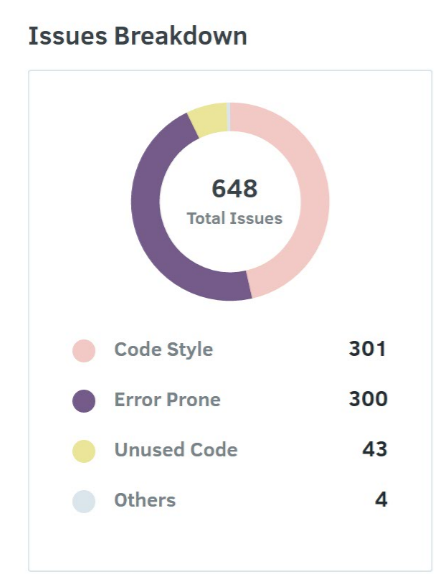
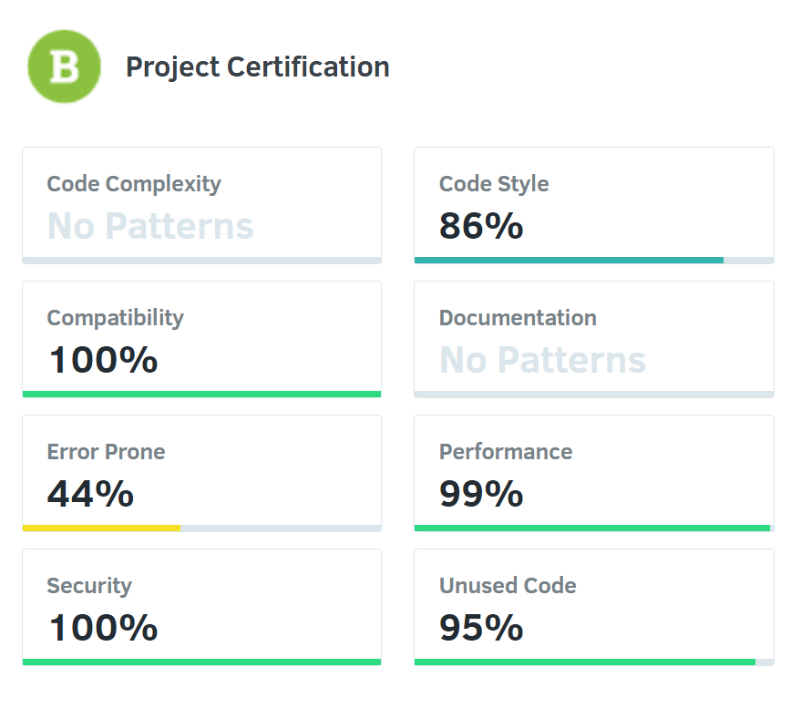

# ESOF - Relatório 4
## WorldEdit

### Verificação e Validação

A verificação e validação (V & V) de *software* é uma __fase do processo de engenharia de *software*__ que tem início assim que os requisitos
do sistema são elaborados e que ocorre em paralelo com as restantes etapas do processo. Os objetivos desta fase são __mostrar que o 
programa respeita os requisitos que foram especificados e que cumpre todos os seus objetivos__, antes que o produto final seja entregue
ao cliente.

A figura abaixo apresenta o V-Model de desenvolvimento de *software*. A imagem tem como objetivo ilustrar que __a verificação e validação
do *software* ocorre em paralelo com todas as outras fases do seu desenvolvimento__.

	
	<em> Figura 1: V-Model de desenvolvimento de software (Fonte: slides das aulas teóricas).</em>

Existe uma diferença fundamental entre os conceitos de verificação e validação de um programa. Por um lado, __a verificação 
consiste em conferir que o *software* cumpre os seus requisitos funcionais e não-funcionais__. Por outro lado, __a validação__ 
é um processo mais abrangente pois __consiste em confirmar que o programa faz precisamente o que cliente pretende que ele faça__. 
A validação de *software* é essencial pois __os requisitos levantados nem sempre traduzem as verdadeiras necessidades dos clientes 
e utilizadores__ do sistema.

A diferença entre verificação e validação de *software* pode ser explicada de forma sucinta citando Barry Boehm, que associa 
a cada uma uma questão:

 * __Verificação__ - “*Are we building the product right?*”
 * __Validação__ - “*Are we building the right product?*”

O seguimento deste relatório divide-se em três principais secções.

Para começar, vamos analisar o __grau de testabilidade do *software*__, que passará pela estudo de diferentes aspetos:
 * __controlabilidade__ do estado dos componentes sob teste;
 * __observabilidade__ dos resultados dos testes;
 * __isolabilidade__ dos componentes a testar;
 * __separação de funcionalidades__;
 * __inteligibilidade__ dos componentes;
 * __heterogeneidade__ das tecnologias usadas.

De seguida, vamos apresentar algumas estatísticas relevantes a esta fase de verificação e validação do *plugin*, nomeadamente,
o número de __casos de teste__ e a percentagem de __cobertura do código__.

Por fim, será relatado o processo de __identificação e correção de um *bug* do *software*__.

### Grau de Testabilidade 

O grau de testabilidade corresponde ao __grau de dificuldade de testar um sistema__ (ou um dos seus componentes). 
Por outras palavras, a testabilidade de um componente indica o __quão fácil é elaborar casos de teste para esse elemento__ 
e o __quão provável é que esses testes revelem defeitos__, caso estes existam. 

Este grau depende de vários fatores, alguns dos quais serão apresentados de seguida para discutir o grau de testabilidade do WorldEdit.

#### Controlabilidade

A controlabilidade refere-se a __quão fácil é controlar o estado do componente sob teste__ (*Component Under Test* - CUT).
No caso do WorldEdit a __controlabilidade não é muito elevada__, isto deve-se principalmente a dois factores:
 * Os componentes estão __muito interligados entre si__ (tal como foi visto no terceiro relatório), o que __dificulta o controlo do 
estado de um componente a cada momento__, visto que é preciso ter em conta a entrada de valores externos ao componente.
 * O WorldEdit é um __*plugin* do Minecraft__, pelo que estas __ligações estendem-se a código que não pertence ao *plugin*__.

O projeto utiliza __testes unitários__ para exercitar as suas classes e métodos.  Estes testes são implementados usando __classes
de teste e a biblioteca JUnit__. 

Nestas classes, é possível distinguir vários tipos de métodos. 

Os métodos com a notação @Test tratam-se das __funções que vão realmente exercitar o código__ usando métodos do tipo *assert*. 

Os métodos com a notação @Before são usados para __inicializar objetos que depois vão ser usados nos métodos de teste__ dessas 
classes. Tratam-se de métodos interessantes para a controlabilidade pois __evitam a repetição da especificação de alguns dos 
*inputs* necessários para testar__ um componente, o que permite que sejam alterados mais facilmente.

A figura abaixo apresenta um excerto de código de um dos ficheiros de teste que utiliza estes dois tipos de métodos, “Test” e “Before”.

	
	<em> Figura 2: Excerto de código de um dos ficheiros de teste, DinnerPermsResolverTest.java.</em>

#### Observabilidade

A observabilidade mede a __facilidade de obter os resultados intermédios e finais dos testes efetuados__.

Neste caso é possível distinguir dois casos:

 * Nas funcionalidades que não interagem, ou interagem pouco, com o Minecraft, é mais fácil de observar se o 
comportamento é o esperado, pois apesar de às vezes o grau de interdependência ser elevado, ainda existe um grau 
de observabilidade aceitável.
 * Nas funcionalidades que interagem directamente com o Minecraft, a tarefa torna-se mais complicada, pois às vezes 
os __resultados só são observáveis no próprio Minecraft__. Como o WorldEdit tem como principal objectivo editar o mundo do Minecraft, 
esta condição é muito frequente, levando a uma __observabilidade reduzida__ nestes casos.

Para poder observar os resultados da execução dos testes unitários, uma possibilidade é importar o projeto para Eclipse,
compilar o código usando o Gradle e correr os testes usando o JUnit. Desta forma, é possível aceder a várias informações
sobre os testes realizados como que testes passaram e, caso seja usado uma ferramenta de análise de cobertura (como o EclEmma),
determinar que percentagem de código de cada *subpackage* é que os métodos de teste cobrem.

O WorldEdit também faz uso de uma ferramenta de *continuous integration* para testar a nova *codebase* com o fim de __encontrar
potenciais erros__. Esta ferramenta, TravisCI, __funciona ao nível dos *commits* feitos no repositório__. Sempre que que é adicionado
um *commit*, este passa por esta ferramenta que faz *build* do *source code* e depois testa o *output* com os testes com quais a ferramenta
está configurada. Assim, o TravisCI __fornece observabilidade a uma escala mais global do projeto__.

#### Isolabilidade

A isolabilidade define __quão fácil é exercitar o componente sob teste de forma isolada__ (sem que os resultados dos testes
sejam enviesados por outros componentes). 

No caso do WorldEdit, a __isolabilidade é relativamente baixa__, visto que os componentes estão bastante interligados.

Para compensar esta baixa isolabilidade, __o WorldEdit faz uso da ferramenta Mockito em algumas das suas classes de teste__.
Esta ferramenta permite definir de forma fácil mock objects. Um mock object é um __objeto com o mesmo interface que os objetos
externos a serem usados no método de teste e que simula as suas funcionalidades de forma previsível__. Assim, um mock object permite 
que, ao testar um método de uma classe A que faça uso de um método de uma classe B, seja possível criar um mock object para a 
classe B de forma a que eventuais erros na definição na classe B não interfiram nos resultados de teste sobre esse método da classe A.

Um exemplo do uso do Mockito no WorldEdit é visível na figura 2, onde são criados mocks para as classes Server e PluginManager,
para que a definição destas classes não interfira nos resultados dos testes sobre a classe DinnerPermsResolver.

#### Separação de Funcionalidades

A separação de funcionalidades indica o __quão bem estão definidas as responsabilidades do componente sob teste__.

Na realização de projetos de dimensão elevada, é __importante garantir que cada funcionalidade fique o mais confinada possível
ao componente que lhe está associado__, tentando torná-lo o mais modular possível. Se isto não acontecer, pode levar a um código
confuso e mal estruturado, tornando mais difícil a sua compreensão e manutenção por parte dos diferentes contribuidores do projeto.

No caso do *plugin* WorldEdit, tal como apresentado no terceiro relatório, os __componentes do projeto são bastante interdependentes__. 
Mesmo assim, estes __têm por norma uma funcionalidade bem definida__, o que nos leva a dizer que existe um __nível intermédio__ de separação 
de funcionalidades.

#### Inteligibilidade

A inteligibilidade indica o __quão um componente está bem documentado e é auto-explicativo__. 

Trata-se de um parâmetro importante da testabilidade pois, quanto mais claro o código for, mais fácil é de o entender corretamente
num menor espaço de tempo, sendo assim __mais simples escrever testes unitários para o exercitar ou de o corrigir__, caso tenha algum *bug*.

Ao nível dos *packages*, é __apenas explicado o papel de cada um dos quatro pacotes principais do projeto__, em <a href="https://github.com/sk89q/WorldEdit/blob/master/COMPILING.md">COMPILING.md</a>. As funcionalidades dos sub-pacotes do projeto, nomeadamente 
os do *package* worldedit-core, não são claramente indicadas, o que dificultou a tarefa de análise mais profunda do código, por 
parte dos autores deste relatório, no momento da elaboração do terceiro relatório, relativo à arquitetura do *software*.

__Ao nível das classes, o projeto encontra-se melhor documentado__, dado que a maior parte das classes em worldedit-core usam notação 
Javadoc para explicar o seu objetivo e dos seus métodos públicos. As classes dos três restantes pacotes principais (worldedit-bukkit,
worldedit-forge e worldedit-sponge) não apresentam esta documentação em Javadoc.

O ficheiro <a href="https://github.com/sk89q/WorldEdit/blob/master/CONTRIBUTING.md">CONTRIBUTING.md</a> especifica que, __para que um *pull request*
seja aceite, todos os métodos públicos que sejam acrescentados têm de ser corretamente documentados com Javadoc__ (usando as notações 
apropriadas como @param e @return). 

Além disso, este ficheiro especifica um __conjunto de regras para que o código escrito seja o mais homogéneo possível__, o que facilita 
a sua legibilidade. Estas regras não são triviais pois, dado que o projeto é *open-source*, o código desenvolvido vem de dezenas de
contribuidores diferentes, cada um tendo os seus hábitos e costumes de escrita de código. Exemplos de regras incluem:
 * seguir as "Oracle coding conventions"
 * usar apenas espaços para indentação
 * não exceder 120 caracteres em cada linha de código

Assim, o inclusão do ficheiro CONTRIBUTING.md no repositório do projeto mostra que os contribuidores do projeto se preocupam que 
o __código se mantenha compreensível__.

#### Heterogeneidade

A heterogeneidade refere-se a __quanto o uso de diferentes tecnologias requer o uso em paralelo de diferentes métodos de teste
de código e ferramentas__.

Uma forte heterogeneidade traz a desvantagem de __adicionar pontos de falha no momento de teste do código__ pois as 
ferramentas usadas podem falhar. Assim, torna-se necessário que os métodos de teste desenvolvidos estejam preparados 
para lidar com este gênero de situações (lançando uma exceção especial ou executando um método de teste equivalente que
não faça uso da ferramenta que falhou).  

O projeto WorldEdit está __inerentemente assente sobre a API do jogo Minecraft__, dada a natureza do *software* que funciona
como uma extensão do Minecraft (trata-se de um *plugin*). Isto cria uma __grande heterogeneidade no projecto__. 

Além disso, o código apresenta a utilização das frameworks JUnit e Mockito para criar e executar código de teste e 
criar __facilidades para imitar funcionalidades do código a testar__, respetivamente.

Dado que as ferramentas usadas pelo WorldEdit têm um bom grau de fiabilidade, os principais contribuidores do projeto consideram 
seguro assumir que as ferramentas usadas funcionarão como esperado.

### Estatísticas de teste

A análise às estatísticas de teste obtidas a partir dos testes unitários permite perceber se estes foram __bem concebidos__ 
(nomeadamente, se cobrem uma parte significativa do código, ou, pelo menos, os módulos mais utilizados, e se exercitam os 
diversos blocos de código com diversos *input*) , se permitem uma __boa validação do código e a detecção de bugs__, e
a __quantidade de código do projeto que foi testada__, o que é bastante importante para o sucesso de um projeto.

As seguintes estatísticas dos testes unitários do WorldEdit foram obtidas usando as ferramentas JUnit e EclEmma, após termos 
carregado o projeto no Eclipse. As estatísticas referem-se à __versão mais atual do repositório__ no dia 29 de fevereiro de 2016, 
por volta das 12 horas.

No repositório, existem dois diretórios de ficheiros de teste: <a href="https://github.com/up201406036/WorldEdit/tree/master/worldedit-core/src/test/java/com/sk89q">um</a> __exercita classes do
package “worldedit-core”__, enquanto que o <a href="https://github.com/up201406036/WorldEdit/tree/master/worldedit-bukkit/src/test/java/com/sk89q">outro</a> __testa aspetos específicos ao código para a plataforma Bukkit__.

	
	<em> Figura 3: Estatísticas produzidas pelo EclEmma usando ambos os diretórios de teste.</em>

Quanto ao diretório de testes específicos para a plataforma Bukkit, existem __apenas 5 testes__. Estes testes __cobrem apenas uma
percentagem pequena do código__, tanto em relação ao “worldedit-core” (apenas 3,6%) como ao “worldedit-bukkit”(5,7%). Apesar da
percentagem de código testado ser maior no caso do “worldedit-bukkit”, a quantidade de instruções deste pacote é muito mais 
reduzida que no “worldedit-core”.

Nas seguintes imagens, podemos analisar os resultados dos testes mais em detalhe:

	
	<em> Figura 4: Cobertura do testes para o “package” worldedit-core, em relação aos testes feitos especificamente para a plataforma Bukkit.</em>

Em relação aos testes que __exercitam aspetos específicos ao código para a plataforma Bukkit no Core do projeto__, podemos observar
as diferentes percentagens de cobertura distribuídas pelos pacotes cujo número total de instruções cobertas pelos testes é maior. 
Podemos observar que o __pacote “main” do projeto tem uma cobertura de apenas 3,8%__, o que não é de estranhar por apenas estarem a 
ser testados aspetos específicos da plataforma Bukkit. 

	
	<em> Figura 5: Cobertura do testes para o “package” worldedit-bukkit, em relação aos testes feitos especificamente para a plataforma Bukkit.</em>

Quanto ao mesmo tipo de testes mas para o __pacote relativo à plataforma Bukkit__, a __cobertura é bastante menor do que seria esperado__,
sendo apenas de 5,7%. Esperava-se que esta percentagem fosse maior por este __pacote ser inteiramente dedicado à plataforma sobre 
a qual os testes incidem__.

Nas imagens seguintes podemos verificar a cobertura dos testes relativos ao código do pacote “core” do projeto.

	
	<em> Figura 6: Cobertura dos testes do worldedit-core para o “package” src.</em>

Em relação aos testes que exercitam o código das classes do package “worldedit-core”, existe um __total de 35 testes__ que produzem
uma __cobertura de 7,1% no pacote “src” do projeto__, um valor bastante __mais baixo do que o esperado__. Alguns dos pacotes internos ao 
“src” que têm maior número de instruções testadas são o “internal.expression.parser” e “blocks”.

Uma __causa possível para esta percentagem ser tão baixa__ é que no ficheiro CONTRIBUTING.md, direcionado a toda a qualquer 
pessoa que queira contribuir para o projeto, é referido que a __produção de testes unitários é opcional__. Como a lista de 
diferentes contribuidores do projeto é bastante extensa, __não existe um grande controlo sobre a percentagem de contribuidores 
que produz testes unitários__ e quem prefere não o fazer. 

Podemos ainda observar, após correr o projeto na ferramenta Codacy, os *issues* do projeto, ou seja problemas, falhas, 
inconsistências ou conflitos no código. 

	
	<em> Figuras 7: Output the ferramenta de análise Codacy.</em>

	
	<em> Figuras 8: Output the ferramenta de análise Codacy.</em>

Desta forma podemos concluir que a __cobertura geral dos testes__ em qualquer dos pacotes principais do projeto (referente a 
plataformas específicas ou ao pacote principal do projeto) é __atualmente baixa__. Deveria ser feito um esforço para aumentar 
a quantidade e talvez a qualidade dos testes.

### Relato da Correção do Bug

<a href="http://dev.enginehub.org/youtrack/issue/WORLDEDIT-3450">Casos</a> <a href="http://dev.enginehub.org/youtrack/issue/WORLDEDIT-3362">particulares</a> <a href="http://dev.enginehub.org/youtrack/issue/WORLDEDIT-2986">do</a> *bug* que encontrámos foram referidos no *issue tracker* do projeto. 

Num destes *issues*, um desenvolvedor do projeto declara o problema como __não reproduzível__. É possível que a versão de então
(há cerca de um ano, 17 de Setembro de 2015) não tivesse este *bug*, mas é facto que na versão atual, este __*bug* existe e é 
facilmente reproduzível__. Com efeito, os autores deste relatório, após terem __identificado as secções do código ligados à 
ocorrência do *bug*__ e de as terem analisado (análise estática), correram o Minecraft com o *plugin* do WorldEdit, usando a 
plataforma Bukkit para __verificar em que condições o *bug* se manifestava__ (análise dinâmica). 

O *bug* está presente no comando “center”. Este comando permite __associar um tipo de bloco ao centro de uma região selecionada__. 
No entanto, o __comando nem sempre tinha o comportamento esperado__.

Uma __descrição mais completa deste *bug* e da forma como este foi corrigido__ está disponível no <a href="https://github.com/sk89q/WorldEdit/pull/371">*pull request*</a> elaborado pelos autores deste relatório.

O *bug* foi __corrigido com sucesso__, e após, efetuar algumas alterações à nossa correção, motivadas por sugestões por parte de 
alguns dos principais contribuidores do projeto, o __*pull request* foi aceite pela comunidade do WorldEdit__.

### Conclusões e Análise Crítica

Em termos de testabilidade, apesar de haver uma forte interdependência entre módulos e uma fraca documentação de certas classes
e sub-pacotes, o __projeto tem várias características que facilitam a verificação e validação do sistema__.

Por um lado, o __projeto usa testes unitários e diversas ferramentas de suporte__  como JUnit, Mockito e TravisCI.

Por outro lado, o projeto apresenta várias regras para contribuir que __impõem que o código seja bem documentado e que 
seja escrito de forma homogénea__, o que contribui para uma __melhor inteligibilidade__.

Neste projeto, as estatísticas não são muito favoráveis visto que os __testes unitários desenvolvidos têm uma cobertura muito 
fraca do código__, como já discutido em secções anteriores.

No entanto, devido ao ambiente sem risco e não-profissional do projeto, é compreensível não haver tanta dedicação a esse nível,
mesmo que não seja o mais correto em termos de boas práticas de desenvolvimento de *software*.

### Bibliografia
- Slides das aulas teóricas
- Software Engineering, Ian Sommerville, 9th Edition, capítulo 8.
- Introduction to Software Testing, Paul Ammann, Jeff Offutt, 2nd Edition, capítulo 3.1. Disponível <a href="https://books.google.pt/books?id=bQtQDQAAQBAJ&pg=PA36&lpg=PA36&dq=software+observability&source=bl&ots=fxbM3-2WiQ&sig=CaObHiSrq32X0HDKHmna-Oalw6E&hl=en&sa=X&ved=0ahUKEwjfk_Dy2cnQAhVH_4MKHTWCAK8Q6AEIITAB#v=onepage&q=software%20observability&f=false">aqui</a>.
- http://builds.enginehub.org/

### Informações

#### Autores
- Andreia Rodrigues (up201404691@fe.up.pt)
	
Percentagem de contribuição: 25%

	
Número aproximado de horas de trabalho: 11 horas

- Eduardo Leite (gei12068@fe.up.pt)
	
Percentagem de contribuição: 25%

	
Número aproximado de horas de trabalho: 11 horas

- Francisco Queirós (up201404326@fe.up.pt)
	
Percentagem de contribuição: 25%

	
Número aproximado de horas de trabalho: 11 horas

- Gonçalo Leão (up201406036@fe.up.pt)
	
Percentagem de contribuição: 25%

	
Número aproximado de horas de trabalho: 11 horas

	
Faculdade de Engenharia da Universidade do Porto - MIEIC

3º ano, 1º semestre - Engenharia de Software

2016-12-04

